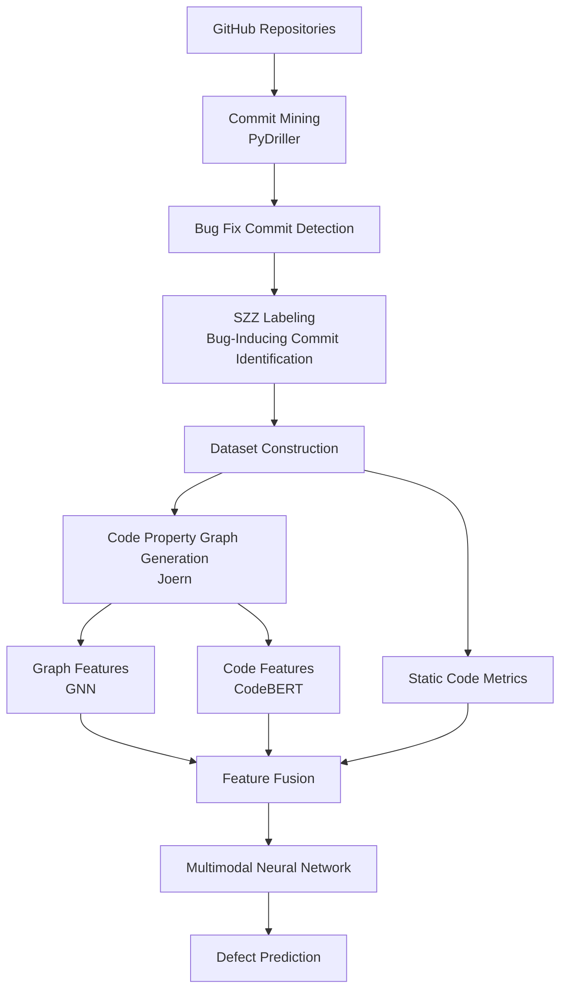
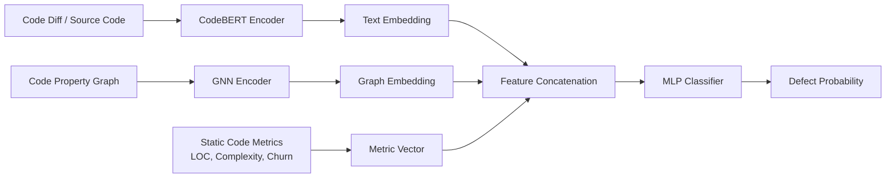

## FP: 멀티모달 소프트웨어 결함 예측 연구 리포

제안서의 Figure 1/2에 맞춰 **GitHub 커밋 마이닝 → BFC 탐지 → SZZ 라벨링(BIC) → 데이터셋 구성(Temporal split) → (CPG/GNN, 텍스트, 정적 메트릭) → 퓨전 모델 → 평가/통계/XAI/강건성** 파이프라인을 재현 가능하게 구성합니다.

## 제안서 다이어그램





## 빠른 시작(Docker)

1) Docker로 개발/실험 환경 실행

```bash
docker compose -f docker/docker-compose.yml up -d --build
```

2) 컨테이너 안에서 패키지 설치(Editable)

```bash
docker compose -f docker/docker-compose.yml exec trainer pip install -e .
```

3) 샘플 파이프라인(로컬 임시 데이터로 end-to-end 1회 실행)

```bash
docker compose -f docker/docker-compose.yml exec trainer python scripts/00_env_check.py
docker compose -f docker/docker-compose.yml exec trainer python scripts/21_build_dataset.py --config configs/exp/sample_end_to_end.yaml
docker compose -f docker/docker-compose.yml exec trainer python scripts/40_train.py --config configs/exp/sample_end_to_end.yaml
docker compose -f docker/docker-compose.yml exec trainer python scripts/50_evaluate.py --config configs/exp/sample_end_to_end.yaml
```

## 라벨 신뢰도(Precision) 감사(audit)

SZZ/라벨이 준비된 데이터셋에 대해 **무작위 샘플 감사 시트**를 생성합니다.

```bash
python scripts/22_label_audit.py --config configs/exp/sample_end_to_end.yaml --n 200
```

생성된 `reports/labeling/label_audit_sheet.csv`에서 `human_verified_is_bug_inducing`을 채운 뒤 다시 실행하면 precision을 계산해 `reports/labeling/label_precision_report.json`에 기록합니다.

## 다중 시드 반복 + 통계(예시)

```bash
python scripts/51_run_multiseed.py --config configs/exp/multiseed_sample.yaml --seeds 1,2,3,4,5
python scripts/52_stats_tests.py --values 0.1,0.2,0.3,0.4,0.5 --out reports/stats/example_bootstrap_ci.json
```

## XAI(SHAP)

```bash
python scripts/60_xai.py --config configs/exp/sample_end_to_end.yaml
```

산출물: `reports/xai/shap_summary.png`

## 강건성(Label flipping)

```bash
python scripts/70_robustness.py --config configs/exp/sample_end_to_end.yaml --flip_probs 0.0,0.1,0.2,0.3,0.4
```

산출물: `reports/robustness/label_flipping.json`

## 산출물 디렉터리 정책

- `data/`: 원천/가공 데이터(커밋하지 않음)
- `artifacts/`: 체크포인트/모델(커밋하지 않음)
- `reports/`: 그림/표/리포트(커밋하지 않음; 필요 시 선택적으로 커밋)

## 문서

- `docs/dataset_schema.md`: 데이터 단위 및 스키마 규약
- `docs/splitting_policy.md`: Temporal split 규약(누수 방지)
- `docker/README.md`: Docker/Defects4J/Joern 실행 가이드

