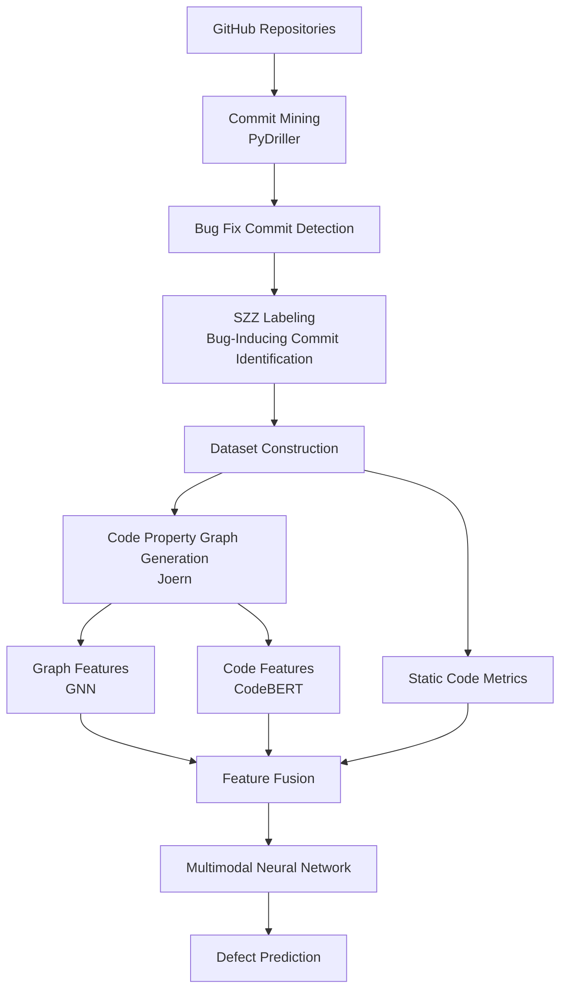
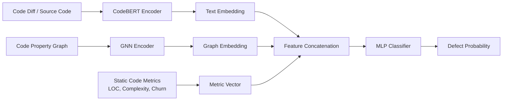

## FP: 멀티모달 소프트웨어 결함 예측 연구 리포

이 리포지토리는 제 졸업논문에서 제안하는 멀티모달 소프트웨어 결함 예측 파이프라인을 구현하고 재현하기 위한 코드와 설정을 담고 있습니다.  
제안서의 Figure 1/2에 대응하는 **GitHub 커밋 마이닝 → BFC 탐지 → SZZ 라벨링(BIC) → 데이터셋 구성(Temporal split) → (CPG/GNN, 텍스트, 정적 메트릭) → 퓨전 모델 → 평가/통계/XAI/강건성** 흐름을 한 자리에서 재현할 수 있도록 설계했습니다.

## 제안서 다이어그램





## 빠른 시작(Docker)

이 섹션에서는 Docker를 사용해 제가 설계한 실험 환경을 빠르게 재현하는 방법을 설명합니다.

1) Docker로 개발/실험 환경 실행

```bash
docker compose -f docker/docker-compose.yml up -d --build
```

2) 컨테이너 안에서 패키지 설치(Editable)

```bash
docker compose -f docker/docker-compose.yml exec trainer pip install -e .
```

3) 샘플 파이프라인(로컬 임시 데이터로 end-to-end 1회 실행)

```bash
docker compose -f docker/docker-compose.yml exec trainer python scripts/00_env_check.py
docker compose -f docker/docker-compose.yml exec trainer python scripts/21_build_dataset.py --config configs/exp/sample_end_to_end.yaml
docker compose -f docker/docker-compose.yml exec trainer python scripts/40_train.py --config configs/exp/sample_end_to_end.yaml
docker compose -f docker/docker-compose.yml exec trainer python scripts/50_evaluate.py --config configs/exp/sample_end_to_end.yaml
```

## 라벨 신뢰도(Precision) 감사(audit)

SZZ 기반 자동 라벨이 실제로 얼마나 신뢰할 수 있는지 확인하기 위해, 저는 무작위 샘플 감사 시트를 생성하여 사람이 직접 검토하는 절차를 포함했습니다.

```bash
python scripts/22_label_audit.py --config configs/exp/sample_end_to_end.yaml --n 200
```

생성된 `reports/labeling/label_audit_sheet.csv`에서 `human_verified_is_bug_inducing`을 채운 뒤 스크립트를 다시 실행하면, 감사 결과를 기반으로 라벨 precision을 계산하여 `reports/labeling/label_precision_report.json`에 기록합니다.

## 다중 시드 반복 + 통계(예시)

```bash
python scripts/51_run_multiseed.py --config configs/exp/multiseed_sample.yaml --seeds 1,2,3,4,5
python scripts/52_stats_tests.py --values 0.1,0.2,0.3,0.4,0.5 --out reports/stats/example_bootstrap_ci.json
```

## XAI(SHAP)

```bash
python scripts/60_xai.py --config configs/exp/sample_end_to_end.yaml
```

산출물: `reports/xai/shap_summary.png`

## 강건성(Label flipping)

```bash
python scripts/70_robustness.py --config configs/exp/sample_end_to_end.yaml --flip_probs 0.0,0.1,0.2,0.3,0.4
```

산출물: `reports/robustness/label_flipping.json`

## 산출물 디렉터리 정책

이 리포지토리에서는 다음과 같이 산출물 디렉터리를 구분하여 버전 관리와 재현성을 동시에 고려했습니다.

- `data/`: 원천/가공 데이터(기본적으로 커밋하지 않음)
- `artifacts/`: 체크포인트/모델(커밋하지 않음)
- `reports/`: 그림/표/리포트(커밋하지 않음; 논문에 포함이 필요한 일부 결과만 선택적으로 커밋 가능)

## 문서

데이터 표현과 분할 규약은 별도 문서로 정리하여, 다른 연구자가 제 코드를 읽지 않고도 실험 설정을 이해할 수 있도록 했습니다.

- `docs/dataset_schema.md`: 데이터 단위 및 스키마 규약
- `docs/splitting_policy.md`: Temporal split 규약(누수 방지)
- `docker/README.md`: Docker/Defects4J/Joern 실행 가이드

