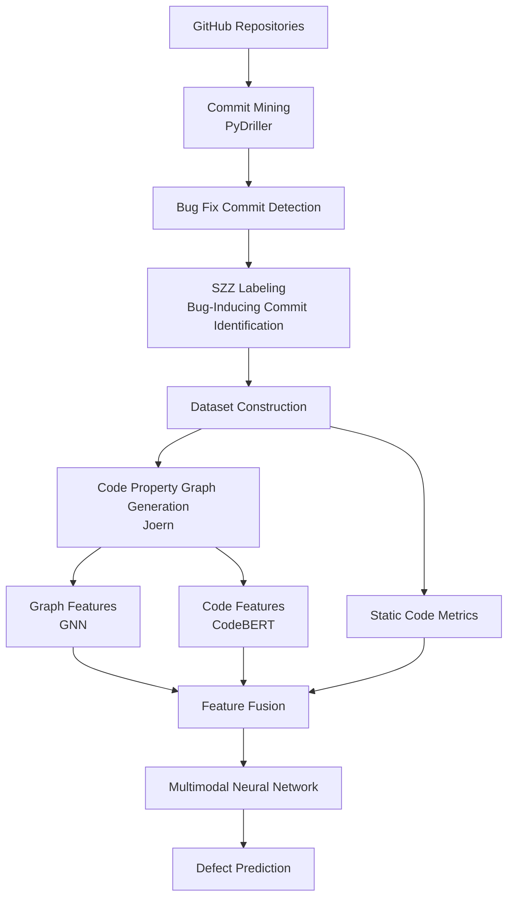
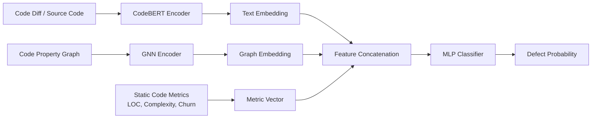

## 멀티모달 소프트웨어 결함 예측 연구 리포

이 리포지토리는 제 졸업논문에서 제안하는 멀티모달 소프트웨어 결함 예측 파이프라인을 구현하고 재현하기 위한 코드와 설정을 담고 있습니다.

실험 목적에 따라 저는 두 종류의 데이터셋을 분리해서 사용합니다. 첫 번째는 기존 연구와의 비교 가능성을 위해 **Defects4J 벤치마크**만 활용하고, 두 번째는 보다 현실적인 환경을 반영하기 위해 **GitHub 저장소를 대상으로 commit mining 후 SZZ 기반 결함 데이터셋**을 구축합니다. 두 데이터셋은 구조와 라벨링 방식이 다르므로 동일한 전처리 파이프라인이 아니라 **각각에 맞는 데이터 처리 절차**를 적용하도록 구성해 두었습니다.  
제안서의 Figure 1/2에 대응하는 **커밋 마이닝 → BFC 탐지 → SZZ 라벨링(BIC) → 데이터셋 구성(Temporal split) → (CPG/GNN, 텍스트, 정적 메트릭) → 퓨전 모델 → 평가/통계/XAI/강건성** 흐름을 한 자리에서 재현할 수 있도록 설계했으며, 초기에는 단일 모달리티(GNN 기반, Transformer 기반) 모델을 먼저 구축한 뒤, 이후 단계에서 멀티모달 특징 결합 모델을 구현해 성능을 분석하는 단계적 실험 전략을 따릅니다.

## 제안서 다이어그램
### Overall research pipeline for multimodal software defect prediction


### Architecture of the multimodal defect prediction model combining code semantics, structural graph features, and static metrics


## 빠른 시작(Docker)

Docker를 사용해 제 실험 환경을 재현하시려면 아래 순서대로 진행하시면 됩니다.

1) 개발/실험용 컨테이너 실행

```bash
docker compose -f docker/docker-compose.yml up -d --build
```

2) 컨테이너 안에서 이 프로젝트를 editable 모드로 설치

```bash
docker compose -f docker/docker-compose.yml exec trainer pip install -e .
```

3) 샘플 파이프라인(end-to-end 1회 실행, 로컬 임시 데이터 사용)

```bash
docker compose -f docker/docker-compose.yml exec trainer python scripts/00_env_check.py
docker compose -f docker/docker-compose.yml exec trainer python scripts/21_build_dataset.py --config configs/exp/sample_end_to_end.yaml
docker compose -f docker/docker-compose.yml exec trainer python scripts/40_train.py --config configs/exp/sample_end_to_end.yaml
docker compose -f docker/docker-compose.yml exec trainer python scripts/50_evaluate.py --config configs/exp/sample_end_to_end.yaml
```

## 라벨 신뢰도(Precision) 감사(audit)

자동 라벨의 신뢰도를 확인하기 위해 무작위 샘플에 대한 감사 시트를 생성하고, 검토자가 `human_verified_is_bug_inducing`를 채운 뒤 다시 실행하면 precision을 계산해 두었습니다.

```bash
python scripts/22_label_audit.py --config configs/exp/sample_end_to_end.yaml --n 200
```

`reports/labeling/label_audit_sheet.csv`에서 해당 컬럼을 채우신 뒤 아래 스크립트를 다시 실행하시면, `reports/labeling/label_precision_report.json`에 precision이 기록됩니다.

## 다중 시드 반복 + 통계(예시)

```bash
python scripts/51_run_multiseed.py --config configs/exp/multiseed_sample.yaml --seeds 1,2,3,4,5
python scripts/52_stats_tests.py --values 0.1,0.2,0.3,0.4,0.5 --out reports/stats/example_bootstrap_ci.json
```

## XAI(SHAP)

```bash
python scripts/60_xai.py --config configs/exp/sample_end_to_end.yaml
```

산출물: `reports/xai/shap_summary.png`

## 강건성(Label flipping)

```bash
python scripts/70_robustness.py --config configs/exp/sample_end_to_end.yaml --flip_probs 0.0,0.1,0.2,0.3,0.4
```

산출물: `reports/robustness/label_flipping.json`

## 산출물 디렉터리 정책

이 리포지토리에서는 다음과 같이 산출물 디렉터리를 구분하여 버전 관리와 재현성을 동시에 고려했습니다.

- `data/`: 원천/가공 데이터(기본적으로 커밋하지 않음)
- `artifacts/`: 체크포인트/모델(커밋하지 않음)
- `reports/`: 그림/표/리포트(커밋하지 않음; 논문에 포함이 필요한 일부 결과만 선택적으로 커밋 가능)

## 문서

데이터 단위·스키마와 분할 규약은 아래 문서에 정리해 두었습니다. 실험 설정을 코드 없이도 파악하실 수 있도록 구성했습니다.

- `docs/dataset_schema.md`: 예측 단위(함수), line-to-function 매핑, 스키마 필드
- `docs/splitting_policy.md`: Temporal split 규약(누수 방지)
- `docker/README.md`: Docker 환경 재현 방법, Joern/Defects4J 활용 시 유의사항

## 참고
- 현재 구현 범위는 RF/LR baseline과 파이프라인·평가까지이며, CodeBERT·GNN·GNNExplainer는 추후 확장
